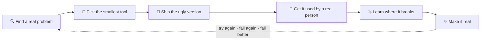

<!-- ═══════════════════════════════════════════════════════════════════════
     leoyigit / README.md  ·  profile README, shot in one scene
     Reel: cold open · character sheet · flashback · the loop · motto · fail better ledger ·
           now shooting · filmography · the kit · box office · credits
     ═══════════════════════════════════════════════════════════════════════ -->


<div align="center">

<a href="https://www.google.com/maps/place/Sarajevo"></a>
<a href="https://flyrank.ai"></a>


</div>

<br/>

## 🎬 Cold open

```text
                              HELLO MOON
                     a profile README in one scene

FADE IN:

INT. KITCHEN TABLE — SARAJEVO — NIGHT

Two kids finally asleep. A camera bag by the door, still packed
from today's shoot. LEO — cinematographer, photographer, dad of
two — opens a laptop that has seen things.

ON SCREEN: a Rust compiler error. Forty-seven lines of it.

                               LEO
                     (to nobody, quoting Beckett)
               Ever tried. Ever failed. No matter.

He fixes one line. Runs it again. Forty-six lines.

                               LEO
               Try again. Fail again. Fail better.

The kitchen light hums. Somewhere, a moon.

                                        CUT TO: the rest of this page
```

<br/>

## 🎞️ Character sheet

```rust
impl Leo {
    const BASED_IN: &str      = "Sarajevo, Bosnia & Herzegovina 🇧🇦";
    const DAY_JOB:  &str      = "FlyRank AI — agentic growth for AI-era search";
    const ROLE:     &str      = "Director of AI Enablement · since Feb 2025";
    const BEFORE:   [&str; 3] = ["cinematographer", "photographer", "multidisciplinary artist"];
    const CHAPTERS: [&str; 3] = ["Istanbul", "Udine", "Sarajevo"]; // three cities, one loop
    const SPEAKS:   [&str; 4] = ["Turkish", "Italian", "English", "Bosnian"];
    const KIDS:     u8        = 2; // the toughest QA team in the Balkans

    /// Beckett (1983), expressed as control flow.
    fn ship(&mut self, problem: RealProblem) -> Shipped {
        loop {
            match self.try_again(&problem) {
                Ok(ugly_version) => return self.make_it_real(ugly_version),
                Err(lesson)      => self.fail_better(lesson),
            }
        }
    }
}
```

<br/>

## 📼 Flashback

Twenty years, three countries, one loop. The code is new. The *try again* isn't.

| Year | Scene | What happened |
|---|:-:|---|
| 2006–2012 | 🇹🇷 Istanbul | Graphic designer at **Plato Film**. Founded **Equinox Dance Project**, Turkey's first artistic project for blind rights, later on national TV. |
| 2008 | 🇹🇷 → 🇮🇹 | One of ten admitted to photography at **Mimar Sinan Fine Arts**. Left for a cinema scholarship at the **University of Udine**. |
| 2009–2010 | 🇮🇹 Udine | Volunteer photographer with **Caritas**, documenting seamen stranded in Italian ports. Became the photo book *Marittimi Abbandonati*. |
| 2011–2014 | 🇮🇹 Udine | Founded **haifame.it**, Italy's first online food-ordering system. Then Just Eat arrived. See the ledger. |
| 2015–2022 | 🇧🇦 Sarajevo | **Google Street View** certified photographer. 360° tours of cafés, museums and hotels. |
| 2018– | 🇧🇦 Sarajevo | Cinematographer and editor at **HR Film**. Three shorts, a feature, a few ads. RED, Sony, Canon. |
| 2019–2024 | 🇧🇦 🇩🇪 | Creative Director at **Capital Holding**. Product designer for **FBK Technologies** in Stuttgart on the side. |
| 2020–2022 | 🇧🇦 🇮🇹 | Visual identity for the **Embassy of Italy in BiH** and the **EU Balkan Forum** brand for the Italian Ministry of Foreign Affairs. |
| 2024–2025 | 🇧🇦 Sarajevo | Merchant Success Manager at **HulkApps** (Shop Circle), Italian merchants on Shopify. Where the storefront work on this page started. |
| 2025– | 🇧🇦 🇵🇱 | **Director of AI Enablement at FlyRank.** System architect and creative director of [**Living Chess**](https://livingchess.net) in Wrocław. |

Plus thirteen video-art and photography exhibitions between Istanbul, Udine, Trieste and Perugia, 2006–2013. The festival circuit, before there was a GitHub.

<details>
<summary><b>🏋️ Training montage</b> · winter 2024–25, the part of the film where the music kicks in</summary>
<br/>

Design school was 2008. The code was self-taught until one winter of doing it properly:

| When | Certificate | From |
|---|---|---|
| Nov 2024 | Project Management Specialization | Google |
| Dec 2024 | Advanced Data Analytics Specialization | Google |
| Dec 2024 | Content Creator Specialization | Adobe |
| Dec 2024 | Product Management: Foundations & Stakeholder Collaboration | IBM |
| Jan 2025 | Python for Everybody Specialization | University of Michigan |
| Jan 2025 | Programming in Python | Meta |
| Jan 2025 | Introduction to Back-End Development | Meta |

Before that: Drama, Art and Music Studies at the University of Udine on a scholarship (2008–2011), and an 800-hour graphic and digital content design diploma, graded 100/100 (Udine, 2008–2009).

</details>

<br/>

## 🔁 The loop

Every project on this page started as a real problem in my own life or work: a kid who needed a math game, a client who needed a store moved, a colleague who needed a table as CSV, me at 2 a.m. needing dark mode. Then the same loop, every time:



> [!TIP]
> This loop is also the backbone of **The Leo Method**, the problem-first track I mentor inside the [FlyRank AI Internship](https://internship.flyrank.ai): **[AI n-able Yourself](https://aifluency.flyrank.ai/)**, ten weeks of General AI Fluency for people who have never written code. Interns don't take lessons. They watch how we actually work, then ship something a real person uses: their own portfolio, live on the internet. Chapter four is literally called *Fail on Purpose*.

<br/>

## 🪶 Motto

<div align="center">
<br/>

**Ever tried. Ever failed. No matter.**<br/>
**Try again. Fail again. Fail better.**

<sub>Samuel Beckett, <i>Worstward Ho</i> (1983)</sub>

<br/>
</div>

*Hello Moon* is the greeting. *Fail better* is the method. Three careers in, it's the only process that has ever worked for me: try, ship, find out where it broke, try again a little smarter. It's how the storefronts get migrated, how the kids' games get built, and the first thing the interns at [AI n-able Yourself](https://aifluency.flyrank.ai/) hear, before anyone mentions a tool.

<br/>

## 🪦 Fail better ledger

Receipts. Every row is real and every link still works. The first row predates GitHub, so you'll have to take my word for it.

| Ever tried | Fail again | Fail better |
|---|---|---|
| **haifame.it** · 2011. The first online food-ordering system in Italy, with funding from the Chamber of Commerce. | 2014. Just Eat entered Italy with a budget a few zeros longer. Closed it. | 2024–2026. Moving other people's storefronts between platforms for a living. The food still gets ordered online. |
| [`testing`](https://github.com/leoyigit/testing) · Sept 2023. A repo called *testing*, described as *test*. My first one. | [`sh`](https://github.com/leoyigit/sh) · 2025. Also described as *test*. Consistency is a virtue. | Everything else on this page. |
| [`dorians-math-app`](https://github.com/leoyigit/dorians-math-app) · 14 Dec 2024 | [`dorian-math-app.github.io`](https://github.com/leoyigit/dorian-math-app.github.io) · 14 Dec 2024, same day | [`leoyigit.github.io`](https://leoyigit.github.io) · 14 Dec 2024. Third repo of the day, and the one that's live. |
| [`portfolio`](https://github.com/leoyigit/portfolio) · 2024. Attempt one at introducing myself. | [`leo.work`](https://github.com/leoyigit/leo.work) · 2025. Attempt two. | This README · 2026. You're reading attempt three. |
| [`shopify-product-explorer-extension`](https://github.com/leoyigit/shopify-product-explorer-extension) · April 2026 | The clients moved to Shopline. | [`shopline-product-explorer-extension`](https://github.com/leoyigit/shopline-product-explorer-extension) · June 2026. Same idea, second platform, two months wiser. |

<br/>

## 🎥 Now shooting

- **♟️ [Living Chess](https://livingchess.net)** · a live social experiment where every participant controls one chess piece and each move is decided collectively. Website in **Rust** (Axum + Askama), deployed on Railway. → [`living-chess-site`](https://github.com/leoyigit/living-chess-site)
- **🚀 [FlyRank Web](https://flyrank.ai)** · the FlyRank marketing site and platform front. **Nuxt 4 · Vue 3 · Tailwind v4 · Supabase**, SSR on Vercel.
- **🛍️ Shopify → Shopline migrations** · moving real storefronts between platforms without losing the design, the SEO, or the client's sleep. Redesigns and the tooling that makes them repeatable.
- **🎓 [AI n-able Yourself](https://aifluency.flyrank.ai/)** · the General AI Fluency track of the [FlyRank AI Internship](https://internship.flyrank.ai), which I mentor. Ten weeks, no coding background required, one real thing shipped at the end: your own portfolio, live. The graduates' credentials come from [`flyrank-internship-badges`](https://github.com/leoyigit/flyrank-internship-badges): six shapes, light and dark, zero dependencies.
- **📝 [convert-to-md](https://github.com/leoyigit/convert-to-md)** · newest tool: type `convert`, drag a file or folder into the terminal, get Markdown. Docs, spreadsheets, PDFs, whole folders.

<br/>

## 🗂️ Filmography

### Features · tools & extensions

| | Project | What it does | Built with |
|:-:|---|---|---|
| 📝 | [convert-to-md](https://github.com/leoyigit/convert-to-md) | Documents, spreadsheets, PDFs and folders → Markdown, from the terminal | `Shell` |
| 🛍️ | [shopify-product-explorer-extension](https://github.com/leoyigit/shopify-product-explorer-extension) | Browse any Shopify store's product catalog from Chrome | `JS` `Chrome` |
| 🛒 | [shopline-product-explorer-extension](https://github.com/leoyigit/shopline-product-explorer-extension) | Same idea, for Shopline stores | `JS` `Chrome` |
| 📋 | [clipboard-manager](https://github.com/leoyigit/clipboard-manager) | Keeps your clipboard history organised | `Chrome` |
| 📊 | [table-to-csv](https://github.com/leoyigit/table-to-csv) | Any HTML table → CSV in one click | `JS` |
| 🎨 | [color-generator](https://github.com/leoyigit/color-generator) | Palette generator for quick design work | `HTML` `JS` |
| 🌑 | [darkmode](https://github.com/leoyigit/darkmode) | Because dark mode is life | `JS` |
| 📍 | [location-finder](https://github.com/leoyigit/location-finder) | Small location utility | `Python` |

<details>
<summary><b>👨‍👧‍👦 Shorts, for a very specific audience</b> · built for my kids, the most honest user testing there is</summary>
<br/>

| | Project | What it does |
|:-:|---|---|
| ⚡ | [dorians-pokemons](https://github.com/leoyigit/dorians-pokemons) | A Pokémon game for kids, designed with my son |
| ➕ | [Dorian's Math App](https://leoyigit.github.io) | Practice math the fun way, live on GitHub Pages |
| 🔎 | [find-the-x](https://github.com/leoyigit/find-the-x) | Solve-for-x puzzles |
| 🌍 | [moja-okolina](https://github.com/leoyigit/moja-okolina) | "My surroundings" school-subject quiz, in Bosnian |
| 🎂 | [dorian](https://github.com/leoyigit/dorian) | A birthday site, because a card is boring |
| 🍼 | [irisfeeding](https://github.com/leoyigit/irisfeeding) | Baby feeding tracker for the newborn days |

</details>

<details>
<summary><b>🏬 Commissioned work</b> · storefront redesigns & migrations, Shopify & Shopline</summary>
<br/>

- [kalsoni-new-design](https://github.com/leoyigit/kalsoni-new-design)
- [gamsa-food-new](https://github.com/leoyigit/gamsa-food-new)
- [tworivermushroom-new](https://github.com/leoyigit/tworivermushroom-new)
- [online-queso-redesign](https://github.com/leoyigit/online-queso-redesign)
- [thechefshouse](https://github.com/leoyigit/thechefshouse)

</details>

<br/>

## 🎒 The kit

<div align="center">

**Primes** · on the camera every day<br/>


**Long glass** · for the hard shots<br/>


**Grip & rigging** · gets it on set and keeps it there<br/>


**The other camera bag** · fifteen years of film and design, still in daily use<br/>


<br/>


<br/>


</div>

<br/>

## 🎟️ Box office

<div align="center">

<!-- Cards by github-profile-summary-cards (the github-readme-stats public instance is paused as of 2026-09;
     if you self-host that project on Vercel, swap these URLs for your own domain). -->
<picture>
  <source media="(prefers-color-scheme: dark)" srcset="https://github-profile-summary-cards.vercel.app/api/cards/profile-details?username=leoyigit&theme=tokyonight" />
  
</picture>

<picture>
  <source media="(prefers-color-scheme: dark)" srcset="https://github-profile-summary-cards.vercel.app/api/cards/stats?username=leoyigit&theme=tokyonight" />
  
</picture>
<picture>
  <source media="(prefers-color-scheme: dark)" srcset="https://github-profile-summary-cards.vercel.app/api/cards/repos-per-language?username=leoyigit&theme=tokyonight" />
  
</picture>

<picture>
  <source media="(prefers-color-scheme: dark)" srcset="https://streak-stats.demolab.com?user=leoyigit&theme=tokyonight&hide_border=true&background=00000000" />
  
</picture>

<br/><br/>

<!-- Contribution snake · generated by .github/workflows/snake.yml (appears after the first workflow run) -->
<picture>
  <source media="(prefers-color-scheme: dark)" srcset="https://raw.githubusercontent.com/leoyigit/leoyigit/output/github-snake-dark.svg" />
  
</picture>

</div>

<br/>

## 🎬 Credits

<div align="center">

<a href="mailto:leo@flyrank.com"></a>
<a href="https://github.com/leoyigit"></a>
<a href="https://www.linkedin.com/in/l%C3%A9o-yigit-ekiz/"></a>
<a href="https://www.behance.net/leoyigit"></a>
<a href="https://flyrank.ai"></a>
<a href="https://livingchess.net"></a>

<br/><br/>

*Filming, photographing and now shipping code from Sarajevo.<br/>
If you're a parent, a maker, or a beginner who thinks it's too late to start: it isn't. Ever tried? Good. Now fail better.*

<br/>

<sub>Motto on loan from Samuel Beckett, <i>Worstward Ho</i> (1983). Moon: original.</sub>

<br/><br/>


</div>


